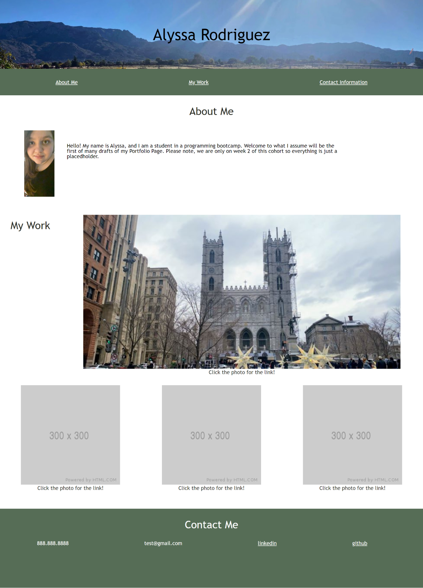
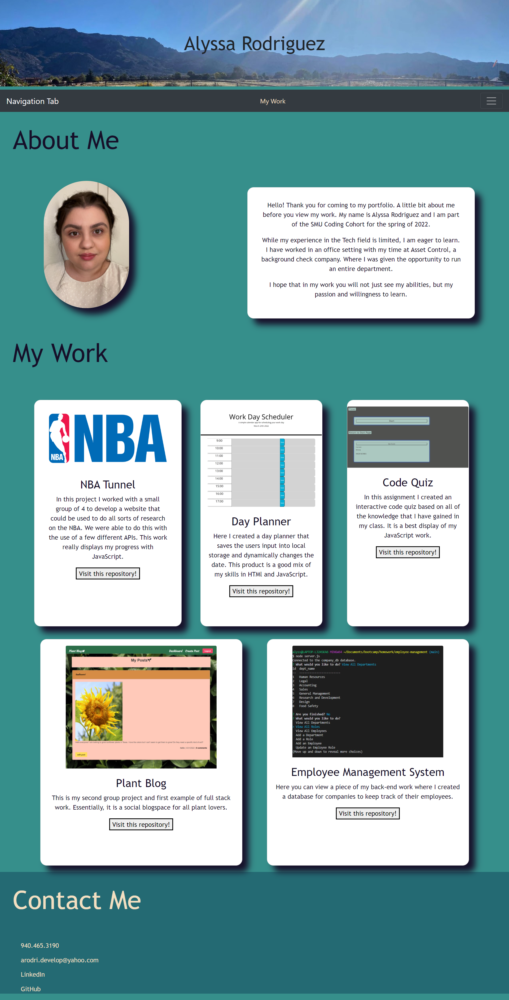

# Professional Portfolio

## Objectives 
In this project, I created a cohesive portfolio page with a recent photo of myyself, my name, contact information and placeholders for links that will one day host my work. The placeholders are placed in a way that is responsive to different viewports. I also made sure that the first application image is larger then the others.

## Screenshot of Final Page

## Link to Final Page

## Contributions
For my reset.css file, I used Eric Meyer's from his [website](https://meyerweb.com/eric/tools/css/reset/)

My tutor provided by this course, David Johnson, was also able to assist in some of the programming.
